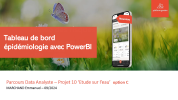

# Etude-et-datavisualisation
Etude épidémiologique pour la société PLAFORM.GARDEN. Datavisualisation et story telling des données de maladies gazon.

Réalisations : 
  + Extraction des données du système d'information.
  + Maquettage du tableau de bord et validation pour propostion client.
  + Pilote auprès d'utilisateurs clé de la société.

Softs Skills travaillées :
  +  Compréhension besoin client.
  +  Proposition de valeur pour la société.
  +  Autonomie.

Compétences travaillées :
  + Carte interactives
  + Filtres avancés, infobulles personnalisées?
  + Nuages de point pour corrélations.

Outils : 
  + PowerBi, Power Query, DAXX

